# auth-server

Keycloak에 OIDC 로그인을 **위임**받아, 플랫폼 전용 **자체 RS256 JWT**를 발급하는 인증 서버(:9000).
myFront(React) 같은 클라이언트는 Keycloak 토큰이 아니라 **이 서버가 발급한 JWT**만 들고 다닌다.
게이트웨이(`gateway-server`, :8000) 뒤에서 `lb://auth-server`로 라우팅되고, eureka(:8761)에 자기등록한다.

> 별도 git repo: `github.com/chanho4702/auth-server` (브랜치 `main`). 우산 repo(MSA_TEMPLATE)에서는 gitignore 됨.
> 전체 토폴로지는 [`../README.md`](../README.md) 참고.

---

## MSA 내 역할 / 아키텍처



- **인증**은 Keycloak이 담당(계정·구글 SSO·로그인 화면).
- **토큰 발급**은 auth-server가 담당 — 자체 RS256 JWT(Access Token) + 회전형 Refresh Token.
- `/.well-known/jwks.json`로 **공개키만** 노출 → 각 마이크로서비스가 `issuer-uri`(=`http://localhost:9000`)만으로 토큰을 **자체 검증**(분산 검증, SSO 토대).
- **eureka 자기등록** — `spring-cloud-starter-netflix-eureka-client`로 `auth-server` 이름을 레지스트리(:8761)에 등록한다. 게이트웨이의 `lb://auth-server`가 이 등록을 해석한다. `prefer-ip-address: true`(Windows/사설망에서 해석 불가 호스트명 등록으로 인한 게이트웨이 `UnknownHostException` 회피, E2E 실측).
- **브라우저 요청은 게이트웨이(:8000)를 경유**한다. `forward-headers-strategy: framework`로 `X-Forwarded-*` 헤더를 신뢰해 OIDC `redirect_uri`가 게이트웨이 호스트 기준으로 구성된다.

**로그인 흐름:** 게이트웨이 경유 OIDC 로그인 성공 → JIT 사용자 프로비저닝(`keycloak_sub` upsert) → RT 쿠키 발급 → 프론트 `/app`(또는 검증 통과한 `post_login_redirect`)로 리다이렉트. 자체 Access Token은 이때 주지 않고, 프론트가 마운트 시 `/api/auth/refresh`로 받는다(silent restore).

## 기술 스택

`build.gradle` 실측:

- **Spring Boot 4.0.6** · **Java 24**(Gradle toolchain) · **Gradle**
- **Spring Cloud 2025.1.2** — eureka client
- Spring Security: `oauth2-client`(Keycloak 위임) + `oauth2-resource-server`(`/api/me` 자체 JWT 검증)
- Spring Data JPA · **Flyway**(`spring-boot-flyway` 자동설정 모듈 + `flyway-core` + `flyway-database-postgresql`) · PostgreSQL
- **Nimbus JOSE+JWT**(RS256 서명, `com.nimbusds`) · Lombok 1.18.46 · `spring-boot-starter-validation`
- 테스트: `spring-boot-starter-test` · `spring-security-test` · H2(runtime)

> Boot 4는 기술별 자동설정을 별도 모듈로 분리했다. `flyway-core`만으로는 기동 시 Flyway가 자동 실행되지 않아 `spring-boot-flyway` 모듈을 명시적으로 추가했다. 컴파일 시 `-parameters` 플래그 유지(Spring Data named param / `@RequestParam` 등 이름 의존).

---

## 인증 플로우

### 1. OIDC 리다이렉트 로그인 → 자체 JWT 발급

1. 프론트가 `/oauth2/authorization/keycloak`(게이트웨이 경유)로 로그인 시작 → Keycloak 로그인 화면. `?kc_idp_hint=google`로 구글 직행.
2. Keycloak 인증 성공 → `authorization_code`로 auth-server에 콜백(`/login/oauth2/code/keycloak`).
3. `LoginSuccessHandler`:
   - `UserService.provision()` — `keycloak_sub`로 upsert(없으면 생성, 있으면 email·name·roles·provider·lastLoginAt 동기화). roles는 Keycloak `realm_access.roles`, provider는 `identity_provider` claim(브로커링 시 "GOOGLE" 등, 없으면 "KEYCLOAK")에서 추출.
   - `RefreshTokenService.issue()` — 자체 RT 발급. 이때 KC `id_token`과 KC `refresh_token`(authorized client에서 추출)을 RT 행에 함께 저장(백채널 로그아웃용).
   - RT 쿠키(`refresh_token`) set → `{frontend-url}/app`로 리다이렉트(오픈 리다이렉트 방어: `/`로 시작하고 `//`가 아닌 상대경로만 허용).
4. 프론트가 마운트 시 `POST /api/auth/refresh` → 자체 Access Token 수령(silent restore).

### 2. 백채널(서버-서버) 로그아웃

`POST /api/auth/logout`:

1. `RefreshTokenService.revokeFamilyByRawToken()` — 자체 RT **패밀리 전체 폐기**, 저장해 둔 KC `refresh_token` 반환.
2. `KeycloakLogoutClient.logout(kcRefreshToken)` — `platform-bff`(컨피덴셜 클라이언트)의 `client_secret`으로 KC `end_session`(`/protocol/openid-connect/logout`)을 **서버-서버 직접 호출**해 SSO 세션 종료.
3. RT 쿠키 삭제 → 응답 `{}`(브라우저 리다이렉트 불필요).

프론트채널 `id_token_hint` 리다이렉트 방식은 id_token 만료 시 KC 세션을 못 끊어 "재로그인 즉시" 문제가 있어 폐기했다. 백채널 호출 실패해도 로컬 세션은 이미 정리됐으므로 로그아웃은 성공 처리(best-effort, 경고 로그만).

## API 엔드포인트

컨트롤러 실측 기준.

| 메서드 | 경로 | 인증 | 설명 |
|---|---|---|---|
| GET | `/oauth2/authorization/keycloak` | - | OIDC 로그인 시작(Keycloak로 리다이렉트). `?kc_idp_hint=google`로 구글 직행 (Spring Security 제공) |
| GET | `/.well-known/jwks.json` | - | 서명 공개키(JWK Set) — `JwksController` |
| POST | `/api/auth/refresh` | RT 쿠키 | RT 회전 + 새 Access Token `{accessToken}` 발급. 쿠키 없으면 401 `{error:"no_refresh_token"}` — `AuthController` |
| POST | `/api/auth/logout` | RT 쿠키 | 토큰 패밀리 폐기 + **KC SSO 세션 백채널 종료** + 쿠키 삭제. 응답 `{}` — `AuthController` |
| GET | `/api/me` | Bearer(자체 JWT) | 토큰 claim 기반 사용자 정보 `{sub,email,name,role,provider}`(role=roles 첫 원소) — `MeController` |

브라우저에서는 게이트웨이(:8000) 경유로 접근한다(예: 로그인 시작 = `http://localhost:8000/oauth2/authorization/keycloak`). 게이트웨이는 `/oauth2/**`·`/login/**`·`/api/auth/**`·`/.well-known/**`·`/api/me`를 경로 그대로(No StripPrefix) auth-server로 라우팅한다.

## 토큰 모델

- **Access Token**: RS256 JWT, TTL 15분(기본). claim `iss/aud/sub(=users.id)/email/name/provider/roles/iat/exp`. 프론트 메모리 보관.
- **Refresh Token**: opaque 32바이트 랜덤(Base64url), TTL 14일(기본). 쿠키 `refresh_token`(HttpOnly · SameSite=Lax · Secure=`platform.cookie-secure`(dev=false) · Path=`/api/auth`). **DB에는 SHA-256 해시만 저장**(원문 저장 안 함).
- **회전 + 재사용 탐지**: refresh마다 새 토큰으로 교체하고 옛 토큰 폐기(`replaced_by` 연결). 이미 교체·폐기된 토큰이 다시 쓰이면 **도난으로 간주해 `family_id` 전체를 폐기**(`ReuseDetectedException`)하고 401.
- **audience 검증**: `JwtDecoder`가 서명·`iss`(`platform.issuer`)뿐 아니라 **`aud`(`platform.audience`=`platform-api`)까지 검증**한다. 다른 발급자·다른 대상의 토큰 거부. board-service 등 리소스서버도 같은 `aud`를 검증한다.
- **역할 매핑**: `/api/me` 리소스서버 체인은 `roles` claim을 `ROLE_` 접두사 권한으로 변환.
- **백채널 로그아웃**: RT 행에 Keycloak `id_token`·`refresh_token`을 함께 보관(V2 마이그레이션, rotate 시 패밀리 내내 승계). 로그아웃 시 KC `refresh_token`으로 end_session 서버-서버 호출.

## 서명 키 — `auth-jwk.json`

`JwtKeyProvider`가 첫 기동 시 RSA 2048 키쌍을 생성해 `./auth-jwk.json`에 저장하고, 이후엔 이 파일을 로드(재시작해도 발급 토큰 유효하도록 키 고정). **개인키 포함 → 커밋 금지**(`.gitignore`에 `/auth-jwk.json` 등록됨). 경로는 `platform.jwk-path`로 변경 가능(null이면 메모리에만 생성 — 테스트용). 운영에선 파일 대신 시크릿 매니저 주입 권장.

## 주요 설정 · 환경변수 (`src/main/resources/application.yml`)

모든 자격증명/URL은 env로 오버라이드 가능하며, 기본값은 로컬 dev 전용이다. **운영에서는 반드시 주입.**

> **CORS는 게이트웨이가 담당한다.** auth-server는 CORS를 직접 설정하지 않는다. 모든 브라우저 요청은 게이트웨이(:8000)를 통과하며 CORS는 게이트웨이 `globalcors`에서 일괄 처리된다.

| 키 | 환경변수 | 기본값 | 비고 |
|---|---|---|---|
| `server.port` | - | 9000 | |
| `server.forward-headers-strategy` | - | `framework` | 게이트웨이 뒤 `X-Forwarded-*` 신뢰 → redirect_uri를 게이트웨이 호스트로 구성 |
| `spring.datasource.url` | `AUTH_DB_URL` | `jdbc:postgresql://localhost:5433/authdb` | |
| `spring.datasource.username` / `password` | `AUTH_DB_USERNAME` / `AUTH_DB_PASSWORD` | `keycloak` / `keycloak` | |
| `spring.jpa.hibernate.ddl-auto` | - | `validate` | 스키마는 Flyway가 관리 |
| `...oauth2.client...keycloak.client-id` | `OIDC_CLIENT_ID` | `platform-bff` | 컨피덴셜 클라이언트 — 백채널 로그아웃에도 사용 |
| `...oauth2.client...keycloak.client-secret` | `OIDC_CLIENT_SECRET` | `platform-bff-secret` | |
| `...oauth2.client...keycloak.issuer-uri` | `KEYCLOAK_ISSUER_URI` | `http://localhost:8080/realms/sso-demo` | |
| `eureka.client.service-url.defaultZone` | `EUREKA_URI` | `http://localhost:8761/eureka` | |
| `platform.access-token-ttl-seconds` | `ACCESS_TOKEN_TTL_SECONDS` | 900 (15분) | AT TTL |
| `platform.refresh-token-ttl-seconds` | `REFRESH_TOKEN_TTL_SECONDS` | 1209600 (14일) | RT TTL |
| `platform.issuer` | `PLATFORM_ISSUER` | `http://localhost:9000` | 자체 JWT `iss` — 각 서비스 검증 기준 |
| `platform.audience` | `PLATFORM_AUDIENCE` | `platform-api` | 자체 JWT `aud` — 리소스서버가 같은 값 검증 |
| `platform.frontend-url` | `FRONTEND_URL` | `http://localhost:5173` | 로그인 성공 후 `{frontend-url}/app` 리다이렉트 |
| `platform.cookie-secure` | `COOKIE_SECURE` | `false` | RT 쿠키 Secure. 운영(https)에서 true |
| `platform.jwk-path` | - | `./auth-jwk.json` | 서명 키 파일 경로 |

### docker 프로필 — split-horizon OIDC

`--spring.profiles.active=docker`에서는 `ContainerClientRegistrationConfig`가 `ClientRegistration`을 **수동 구성**한다(빈이 있으면 Boot 자동 디스커버리는 백오프). 컨테이너에서 브라우저(front)와 서버-서버(back)가 서로 다른 호스트로 Keycloak에 닿기 때문:

- 브라우저 인가/iss 검증 = `KEYCLOAK_FRONT_ISSUER`(기본 `http://localhost:8080/realms/sso-demo`) — 실제 토큰 `iss`.
- token/jwks/userinfo(서버-서버) = `KEYCLOAK_ISSUER_URI`(docker에서 `http://keycloak:8080/realms/sso-demo`).

`KeycloakLogoutClient`도 `KEYCLOAK_ISSUER_URI`(백채널 = 컨테이너 내부 DNS)로 end_session URL을 구성한다.

## 실행 방법

**전제:** Keycloak + Postgres가 먼저 떠 있어야 한다 → [`../infra/README.md`](../infra/README.md) 참고 (`cd infra/keycloak && docker compose up -d`).

### gradlew

```powershell
# Windows PowerShell — JDK 24 필요(기본 JDK가 11/17이면 실패)
$env:JAVA_HOME = 'C:\Program Files\Java\jdk-24'
.\gradlew.bat bootRun        # :9000 기동
```

기동 확인: `http://localhost:9000/.well-known/jwks.json` → `{"keys":[{"kty":"RSA",...}]}`

### IntelliJ (권장)

repo에 커밋된 공유 Run Config 2개가 실행 버튼에 자동으로 나타난다(`.run/`):

- **`bootRun`** — 기본 dev 기동.
- **`bootRun (nginx)`** — nginx 통합배포 모드용. `FRONTEND_URL=http://localhost` 환경변수만 추가.

> 브라우저 로그인 플로우 전체를 돌리려면 `gateway-server(:8000)`와 `myFront(:5173)`도 함께 떠 있어야 한다. 포트 맵: gateway 8000 / auth 9000 / board 9100 / Keycloak 8080 / Postgres 5433 / myFront 5173 / eureka 8761.

### 컨테이너 (`Dockerfile`)

런타임 전용 이미지. jar는 `gradlew bootJar` 산출물(`build/libs/app.jar`)을 복사한다.

```powershell
.\gradlew.bat bootJar                 # build/libs/app.jar 생성
docker build -t auth-server .         # eclipse-temurin:24-jre, EXPOSE 9000
```

## 테스트 / 빌드

```powershell
$env:JAVA_HOME = 'C:\Program Files\Java\jdk-24'
.\gradlew.bat test     # JUnit 전체 (11개 테스트 클래스, 약 28개 @Test)
```

- 테스트는 H2 인메모리(`MODE=PostgreSQL`) + Hibernate `create-drop`을 쓰고 Flyway/실제 Keycloak에 의존하지 않는다(`application-test.yml`, `eureka.client.enabled=false`).
- `@SpringBootTest`는 `TestOAuth2ClientConfig`(오프라인 `ClientRegistrationRepository`)를 import해 Keycloak 없이 컨텍스트가 뜬다(`@ConditionalOnMissingBean`으로 discovery 백오프).

## 프로젝트 구조

```
auth-server/
├─ build.gradle                                             (Boot 4.0.6 · Java 24 · Spring Cloud 2025.1.2)
├─ Dockerfile                                               (temurin 24-jre, app.jar 복사)
├─ .run/                                                    IntelliJ 공유 Run Config (bootRun, bootRun (nginx))
├─ auth-jwk.json                                            (첫 기동 시 생성, gitignore — 개인키)
└─ src/main/java/com/platform/authserver/
   ├─ AuthServerApplication.java
   ├─ jwt/       JwtKeyProvider · JwtService · JwksController        (RS256 발급 + JWKS)
   ├─ user/      User · UserRepository · UserService                (JIT 프로비저닝)
   ├─ token/     RefreshToken(+Repository) · RefreshTokenService · CookieFactory · ReuseDetectedException
   ├─ auth/      OidcClaims · LoginSuccessHandler · AuthController · MeController · KeycloakLogoutClient
   └─ config/    SecurityConfig · ContainerClientRegistrationConfig (docker 프로필 split-horizon OIDC)
src/main/resources/db/migration/
├─ V1__init.sql                                             (users, refresh_tokens)
└─ V2__add_kc_refresh_token.sql                             (백채널 로그아웃용 kc_refresh_token 컬럼)
```

보안 필터체인 2개(`SecurityConfig`): `/api/me` = 자체 JWT 리소스서버(stateless, iss+aud 검증), 그 외 = oauth2Login + `/api/auth/**`·`/.well-known/**`·`/error` permitAll.

## 다른 서비스와의 연동

- **gateway-server(:8000)** — 단일 진입점. `lb://auth-server`로 라우팅, CORS·`X-Forwarded-*` 처리. 브라우저는 항상 게이트웨이 경유.
- **eureka-server(:8761)** — auth-server가 자기등록(하트비트). 게이트웨이의 `lb://` 해석 대상.
- **Keycloak(:8080, realm `sso-demo`)** — OIDC 인증 위임(계정·구글 SSO). 클라이언트 `platform-bff`(컨피덴셜). 로그인은 authorization_code, 로그아웃은 end_session 백채널.
- **PostgreSQL(:5433, `authdb`)** — users·refresh_tokens. Flyway 마이그레이션.
- **board-service 등 리소스서버** — auth-server의 `/.well-known/jwks.json`으로 자체 JWT를 분산 검증(같은 `iss`·`aud`).

## 트러블슈팅

- **`Gradle requires JVM 17 or later`** → `JAVA_HOME`을 JDK 24로. (기본이 11)
- **부팅 시 `Schema validation: missing table refresh_tokens`** → Flyway가 안 돈 것. `spring-boot-flyway` 의존성이 있는지 확인(Boot 4는 autoconfig가 모듈 분리됨). authdb가 비어있으면 infra를 `docker compose down -v && up -d`로 재초기화.
- **부팅 시 `Connection refused .../openid-configuration`** → Keycloak(:8080)이 안 떠 있음. infra 먼저 기동.
- **로그인 후 `/api/me`가 401** → Access Token(Bearer) 없이 호출했거나 만료. `/api/auth/refresh`로 새 토큰부터. `aud`/`iss` 불일치도 401.
- **게이트웨이 `lb://auth-server` 해석 실패(UnknownHostException)** → eureka 등록 호스트명 문제. `prefer-ip-address: true` 확인, eureka(:8761) 기동 여부 확인.
